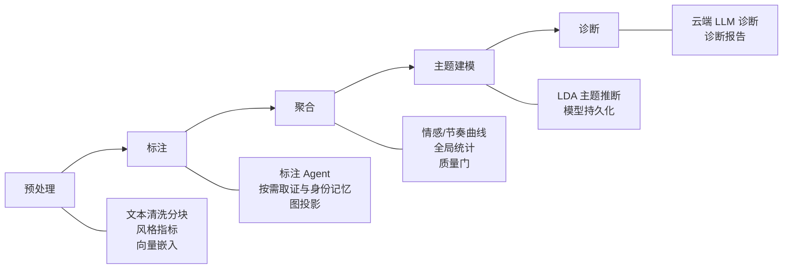
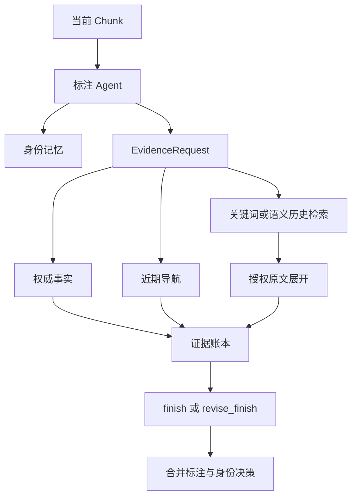

# NovelIQ

> [English](README_EN.md)


## 项目简介

一个面向中文网络小说的智能分析平台，将自然语言处理、大语言模型与图计算结合，提供从文本导入到诊断报告的全链路自动化分析。系统接收 txt 格式小说，自动完成编码检测、清洗、分词和章节优先分块，经五阶段流水线（预处理→标注→聚合→主题建模→诊断）产出分析结果，每阶段独立持久化、可断点恢复。

### 核心能力

| 能力 | 说明 |
|------|------|
| **LLM 智能标注** | 单一 LangGraph Agent 按需调用身份、权威事实和历史原文工具，一次提交人物、伏笔、对话、关系与身份决策 |
| **统一证据检索（RAG）** | `EvidenceRequest` 统一约束权威事实、导航、关键词、语义检索和原文展开的历史边界与读取授权 |
| **实体消歧** | 标注 Agent 在同一工具循环中维护身份记忆；低置信度决策不会写入跨 chunk 记忆 |
| **多维度量化指标** | 情感曲线、节奏曲线、词汇丰富度（TTR/MTLD）、句长统计、对话比例、叙事结构识别 |
| **知识图谱** | 人物关系网络构建与可视化、权威知识图谱、实体别名管理 |
| **主题建模** | LDA 主题推断、主题-文档分配、主题词云 |
| **诊断报告** | 云端 LLM 生成整体质量评估，涵盖叙事类型、主题、价值观 |
| **实时进度** | SSE 推送分析进度到前端，支持任务创建、取消和恢复 |

### 技术栈

| 层 | 技术 |
|----|------|
| 后端 | Python 3.12 / FastAPI / SQLAlchemy / PostgreSQL 17（pgvector） |
| 模型 | OpenAI SDK（兼容本地 vLLM 和云端模型） / jieba / gensim / NetworkX |
| 前端 | React 19 / TypeScript / ECharts / AntV G6 / Radix UI / Tailwind CSS |
| 部署 | Docker Compose / Nginx |

## 快速开始

### Docker部署（推荐）

1. 配置环境变量

   ```powershell
   Copy-Item .env.docker.example .env.docker
   # 编辑 .env.docker，配置模型API地址和密钥
   ```

2. 启动服务

   ```powershell
   docker compose up -d --build
   ```

3. 访问服务

   - 前端：<http://localhost:18080>
   - API文档：<http://localhost:18080/api/docs>

### 源码安装

1. 安装依赖

   ```powershell
   ./scripts/dev.ps1 setup
   ```

2. 配置环境变量

   ```powershell
   Copy-Item .env.example .env
   # 编辑 .env，配置数据库连接和模型API密钥
   ```

3. 初始化数据库并启动

   ```powershell
   alembic upgrade head
   ./scripts/dev.ps1 api --port 8000
   ```

4. 启动前端（新终端窗口）

   ```powershell
   cd frontend
   npm install
   npm run dev
   ```

   前端访问 <http://localhost:5173>，通过 Vite 代理转发 `/api` 到后端 8000 端口。

## 配置说明

### 配置文件

- `config/settings.json`：应用参数配置（模型、分块、指标等）
- `.env` / `.env.docker`：数据库与模型服务连接信息

### 环境变量

环境文件使用普通平铺键值对，数据库、测试数据库、文本模型和 Embedding 模型分别配置：

```env
DATABASE_URL=...
DATABASE_USERNAME=...
DATABASE_PASSWORD=...
TEST_DATABASE_URL=...
TEST_DATABASE_USERNAME=...
TEST_DATABASE_PASSWORD=...
MODEL_BASE_URL=...
MODEL_ID=...
MODEL_KEY=...
EMBEDDING_MODEL_BASE_URL=...
EMBEDDING_MODEL_ID=...
EMBEDDING_MODEL_KEY=...
```

数据库账号密码保持在独立变量中，不写入 `DATABASE_URL`；模型密钥、模型 ID 和服务地址也分别配置。文本标注、标注兜底和诊断任务共用 `MODEL` 这一组变量。完整格式参考 `.env.example` 和 `.env.docker.example`。

## 使用方法

### API调用示例

```python
import requests

# 上传小说
response = requests.post(
    "http://localhost:8000/api/novels/upload",
    files={"file": open("novel.txt", "rb")}
)

# 启动分析
novel_id = response.json()["novel_id"]
analysis_response = requests.post(
    f"http://localhost:8000/api/novels/{novel_id}/tasks"
)
```

### 前端使用

访问 <http://localhost:18080>（Docker）或 <http://localhost:5173>（源码）：

1. 上传小说文件
2. 选择分析配置
3. 启动分析任务
4. 查看分析结果和可视化图表

## API文档

启动服务后访问：

- Docker模式：<http://localhost:18080/api/docs>
- 源码模式：<http://localhost:8000/api/docs>
- ReDoc（源码模式）：<http://localhost:8000/api/redoc>

## 架构设计

### 系统分层

系统采用四层架构，层间单向依赖：

```
┌─────────────────────────────────────────────────────────┐
│  API 层 (src/api/routes, models, dependencies)          │
│  HTTP 参数绑定、响应装配、SSE 实时推送                   │
├─────────────────────────────────────────────────────────┤
│  Service 层 (src/api/services)                          │
│  任务生命周期编排、阶段调度、取消/删除状态机、结果查询    │
├─────────────────────────────────────────────────────────┤
│  Workflow 层 (src/workflows)                            │
│  核心业务逻辑：预处理、标注、聚合、主题建模、诊断        │
│  不感知 HTTP 层，可被 API 和 CLI 共同调用                │
├─────────────────────────────────────────────────────────┤
│  Domain + Storage 层 (src/storage, rag, models, ...)    │
│  数据持久化、LLM 交互、指标计算、证据检索、知识图谱      │
└─────────────────────────────────────────────────────────┘
```

调用方向：`Route → Service → StageExecutor → Workflow → Domain/Storage`

### 分析工作流

分析任务严格按以下阶段顺序执行，每阶段完成后持久化结果，支持断点恢复：



| 阶段 | 入口 | 产出 |
|------|------|------|
| **预处理** | `run_preprocess` | 文本清洗分块、风格指标、向量嵌入 |
| **标注** | `run_annotate` | 标注 Agent 生成合并标注、身份决策和图投影 |
| **聚合** | `run_aggregate` | 情感/节奏曲线、全局统计、质量门检查 |
| **主题建模** | `run_topic_model` | LDA 主题推断与模型持久化 |
| **诊断** | `run_diagnose` | 诊断 Agent 基于工具取证生成诊断报告 |

### 标注与 RAG 的交互

每个 chunk 由一个标注 Agent 处理。Agent 先查询身份记忆，并按需要通过 `EvidenceRequest` 请求权威事实、近期导航、关键词或语义检索；历史 chunk 只能在同一取证目标下展开已定位的结果。



首次 `finish` 提交完整结果；校验失败时 `revise_finish` 只提交需要更正的顶层字段。模型响应、有效 Provider Token 用量和实际工具取证均写入审计记录。

### 设计原则

- **数据库为唯一业务真相**：TaskManager 仅作进程级执行缓存，所有状态查询以数据库为准
- **阶段可恢复**：每阶段完成后持久化结果，重分析时可跳过已完成阶段
- **取消信号双层传递**：内存 cancel_event（快速响应）+ DB cancel_requested（跨进程可靠）
- **证据授权闭环**：历史原文必须先由关键词或语义检索定位，并以相同取证目标授权展开
- **结果可追溯**：标注与诊断均记录模型响应、有效 Provider Token 用量和实际取证来源
- **工具循环受限**：普通工具调用达到配置上限后停止，避免无界循环

## 当前 Agent 运行约束

- 标注 Agent 的完整输出必须通过当前 chunk 原文、身份记忆和本轮证据账本校验
- 诊断 Agent 必须先调用取证工具，且主题标签数量与主题数据一致，才可以提交结果
- 标注模型输出流断流时，以同一消息链重发当前模型请求（重试次数按 `total_attempts` 配置，默认 3 次）
- 文本标注和诊断使用同一文本模型连接；Embedding 使用独立连接
