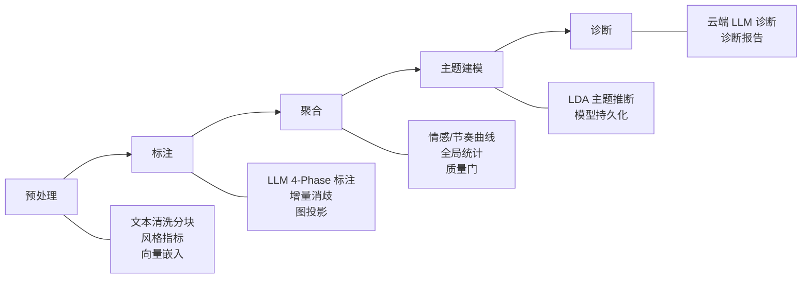
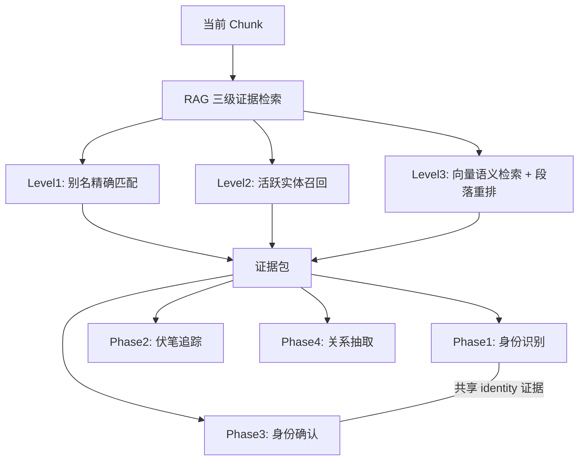

# 小说量化分析系统

> [English](README_EN.md)


## 项目简介

一个面向中文网络小说的智能分析平台，将自然语言处理、大语言模型与图计算结合，提供从文本导入到诊断报告的全链路自动化分析。系统接收 txt 格式小说，自动完成编码检测、清洗、分词和语义分块，经五阶段流水线（预处理→标注→聚合→主题建模→诊断）产出分析结果，每阶段独立持久化、可断点恢复。

### 核心能力

| 能力 | 说明 |
|------|------|
| **LLM 智能标注** | 四阶段标注流程：身份识别→伏笔追踪→身份确认→关系抽取，支持流式输出和结构化输出 |
| **三级证据检索（RAG）** | Level1 别名精确匹配 → Level2 活跃实体召回 → Level3 向量语义检索+段落重排，为标注提供上下文 |
| **实体消歧** | 增量消歧（每 N 个 chunk）+ 全量消歧（最终），自动识别人物别名和匿名人物 |
| **多维度量化指标** | 情感曲线、节奏曲线、词汇丰富度（TTR/MTLD）、句长统计、对话比例、叙事结构识别 |
| **知识图谱** | 人物关系网络构建与可视化、权威知识图谱、实体别名管理 |
| **主题建模** | LDA 主题推断、主题-文档分配、主题词云 |
| **诊断报告** | 云端 LLM 生成整体质量评估，涵盖叙事类型、主题、价值观 |
| **实时进度** | SSE 推送分析进度到前端，支持任务创建、取消和恢复 |

### 技术栈

| 层 | 技术 |
|----|------|
| 后端 | Python 3.12 / FastAPI / SQLAlchemy / PostgreSQL 17（pgvector） |
| 模型 | OpenAI SDK（兼容本地 vLLM 和云端模型） / jieba / gensim / NetworkX |
| 前端 | React 19 / TypeScript / ECharts / AntV G6 / Radix UI / Tailwind CSS |
| 部署 | Docker Compose / Nginx |

## 快速开始

### Docker部署（推荐）

1. 配置环境变量

   ```powershell
   Copy-Item .env.docker.example .env.docker
   # 编辑 .env.docker，配置模型API地址和密钥
   ```

2. 启动服务

   ```powershell
   docker compose up -d --build
   ```

3. 访问服务

   - 前端：<http://localhost:18080>
   - API文档：<http://localhost:18080/api/docs>

### 源码安装

1. 安装依赖

   ```powershell
   ./scripts/dev.ps1 setup
   ```

2. 配置环境变量

   ```powershell
   Copy-Item .env.example .env
   # 编辑 .env，配置数据库连接和模型API密钥
   ```

3. 初始化数据库并启动

   ```powershell
   alembic upgrade head
   ./scripts/dev.ps1 api --port 8000
   ```

4. 启动前端（新终端窗口）

   ```powershell
   cd frontend
   npm install
   npm run dev
   ```

   前端访问 <http://localhost:5173>，通过 Vite 代理转发 `/api` 到后端 8000 端口。

## 配置说明

### 配置文件

- `config/settings.json`：应用参数配置（模型、分块、指标等）
- `.env` / `.env.docker`：环境变量和敏感信息

### 环境变量

参考 `.env.example` 和 `.env.docker.example` 获取完整配置项。

**必填项：**

- `DATABASE_URL` / `DATABASE_USERNAME` / `DATABASE_PASSWORD`：数据库连接
- `ANNOTATION_*`：标注模型服务
- `SEMANTIC_CHUNKING_*`：语义分块嵌入服务
- `FULL_DISAMBIG_*`：全量消歧模型
- `DIAGNOSIS_*`：诊断模型

**可选项：**

- `ANNOTATION_FALLBACK_*`：标注兜底模型
- `INCREMENTAL_DISAMBIG_*`：增量消歧模型
- `MENTION_EXTRACTION_*`：LLM mention提取模型
- `LEVEL3_RERANK_*`：Level3重排模型
- `TEST_DATABASE_URL`：测试数据库（运行测试必须配置）

## 使用方法

### API调用示例

```python
import requests

# 上传小说
response = requests.post(
    "http://localhost:8000/api/novels/upload",
    files={"file": open("novel.txt", "rb")}
)

# 启动分析
novel_id = response.json()["novel_id"]
analysis_response = requests.post(
    f"http://localhost:8000/api/novels/{novel_id}/tasks"
)
```

### 前端使用

访问 <http://localhost:18080>（Docker）或 <http://localhost:5173>（源码）：

1. 上传小说文件
2. 选择分析配置
3. 启动分析任务
4. 查看分析结果和可视化图表

## API文档

启动服务后访问：

- Docker模式：<http://localhost:18080/api/docs>
- 源码模式：<http://localhost:8000/api/docs>
- ReDoc（源码模式）：<http://localhost:8000/api/redoc>

## 架构设计

### 系统分层

系统采用四层架构，层间单向依赖：

```
┌─────────────────────────────────────────────────────────┐
│  API 层 (src/api/routes, models, dependencies)          │
│  HTTP 参数绑定、响应装配、SSE 实时推送                   │
├─────────────────────────────────────────────────────────┤
│  Service 层 (src/api/services)                          │
│  任务生命周期编排、阶段调度、取消/删除状态机、结果查询    │
├─────────────────────────────────────────────────────────┤
│  Workflow 层 (src/workflows)                            │
│  核心业务逻辑：预处理、标注、聚合、主题建模、诊断        │
│  不感知 HTTP 层，可被 API 和 CLI 共同调用                │
├─────────────────────────────────────────────────────────┤
│  Domain + Storage 层 (src/storage, rag, models, ...)    │
│  数据持久化、LLM 交互、指标计算、证据检索、知识图谱      │
└─────────────────────────────────────────────────────────┘
```

调用方向：`Route → Service → StageExecutor → Workflow → Domain/Storage`

### 分析工作流

分析任务严格按以下阶段顺序执行，每阶段完成后持久化结果，支持断点恢复：



| 阶段 | 入口 | 产出 |
|------|------|------|
| **预处理** | `run_preprocess` | 文本清洗分块、风格指标、向量嵌入 |
| **标注** | `run_annotate` | LLM 4-Phase 标注（身份→伏笔→确认→关系）、增量消歧、图投影 |
| **聚合** | `run_aggregate` | 情感/节奏曲线、全局统计、质量门检查 |
| **主题建模** | `run_topic_model` | LDA 主题推断与模型持久化 |
| **诊断** | `run_diagnose` | 云端 LLM 诊断报告 |

### 标注与 RAG 的交互

标注阶段是系统最复杂的环节，每个 chunk 标注前会调用 RAG 三级证据检索：



Phase1 和 Phase3 共享 identity 证据以避免重复检索。

### 设计原则

- **数据库为唯一业务真相**：TaskManager 仅作进程级执行缓存，所有状态查询以数据库为准
- **阶段可恢复**：每阶段完成后持久化结果，重分析时可跳过已完成阶段
- **取消信号双层传递**：内存 cancel_event（快速响应）+ DB cancel_requested（跨进程可靠）
- **RAG 三级递进**：Level1 精确匹配 → Level2 活跃实体 → Level3 语义检索，每级可独立开关

## 开发路线图

以下为已确认但尚未完成的方向，按优先级排列：

| 方向 | 状态 | 说明 |
|------|------|------|
| Phase1 runtime 对齐与 prompt 拆分 | 待实现 | 解决 Phase1 绕开统一 thin runtime、prompt 硬编码问题 |
| 主题命名迁移到 topic 阶段 | 待实施 | 将主题命名职责从 diagnosis 迁移到 topic，diagnosis 不再拥有主题命名主责 |
| 集成学习多信号投票框架 | 设计稿 | 统一仲裁词表、规则、LLM 标注等多源信号冲突，替代手工权重 |
| annotation router 与预判断 | 另案评估 | 评估按需触发 Phase2/3/4 的调度策略，降低调用成本 |
| LLM 上下文预算与 prompt 裁剪 | 讨论稿 | 多条 LLM 交互链路上下文利用不足，待补充 token 分布事实后再定方案 |
| 增量/全量消歧与诊断 SSE | 现状审查 | 增量消歧和全量消歧无独立 SSE，诊断无流式输出，待改造 |
| Level3 mention retrieval 评测 | 延期 | mention 级召回与 paragraph 局部 evidence 的评测闭环延期，不阻塞主线 |
