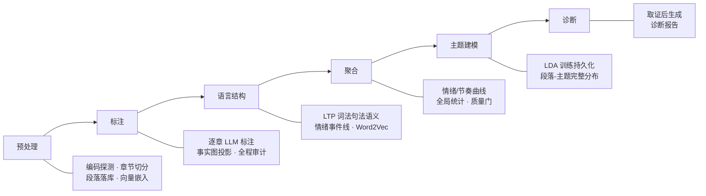

# NovelIQ

> [English](README_EN.md)


[](LICENSE)

对中文网络小说做量化分析的平台：上传一本 txt 全本，六阶段流水线自动完成全书分析。LLM 逐章标注人物、对话、关系、事件与伏笔，配合本地语言模型产出多维指标，最终汇成一组可视化视图与诊断报告。分析在后台运行、逐阶段落库，中断或取消后可从断点继续。

分析完成后，前端提供：

- **情感 / 节奏曲线**：段落级情感打分与叙事节奏指标，全书曲线，窗口可切换
- **人物关系图谱**：标注 Agent 逐章记录人物、对话与关系，跨章合并成网络，力导向图浏览
- **事件时间线**：情节事件沿时间轴呈现
- **主题分布**：LDA 主题建模，检测主题随情节的转移
- **语言特征**：LTP 词法句法分析、词汇丰富度（TTR/MTLD）、对话比例等
- **诊断报告**：LLM 基于全书取证生成质量评估，可导出为单文件 HTML

| 情绪/节奏曲线 | 人物关系图谱 |
| --- | --- |
|  |  |
| **叙事时间轴** | **仪表盘** |
|  |  |

技术栈：Python 3.12 / FastAPI / SQLAlchemy / PostgreSQL 17（pgvector）；React 19 / Vite / ECharts / Tailwind CSS。LLM 走 OpenAI 兼容接口（本地 vLLM 或云端服务均可），词法分析与词向量为本地离线模型。

## 快速开始

### 前置：离线模型

LTP 与 Word2Vec 从本地加载，**不会自动联网下载**，均可经设置启停：

- **LTP**（`linguistic.ltp.enabled`，默认开启）：完整离线模型目录，路径经 `LTP_MODEL_DIR` 环境变量配置。开启但模型缺失时，分析在「语言结构」阶段报错；关闭则跳过词法/句法/语义标注
- **Word2Vec**（`linguistic.word2vec.enabled`，默认关闭）：关闭时无需模型；开启后需 `models/word2vec/shared/` 下的转换 `.kv` 主文件（依赖 LTP 词元），缺失同样在「语言结构」阶段报错。已有 `.vec`/`.bin`/`.txt` 预训练向量时执行：

  ```powershell
  uv run python -m scripts.tools.convert_word2vec_pretrained
  ```

  默认从 `models/word2vec/pretrained/` 读取，写入 `models/word2vec/shared/`。

`models/` 不进 Git；Docker Compose 会把宿主机该目录挂载到容器 `/app/models`。

### Docker 部署（推荐）

```powershell
Copy-Item .env.docker.example .env.docker   # 填入模型 API 密钥
docker compose up -d --build
```

`.env.docker` 的数据库已预置指向 Compose 内置的 Postgres，需要填的只有文本模型（`MODEL_*`）和 Embedding 服务地址；模型目录从宿主机 `./models` 挂载。

- 前端：<http://localhost:18080>
- API 文档：<http://localhost:18080/api/docs>

### 源码运行

需要本地 PostgreSQL 17（含 pgvector 扩展）。

```powershell
./scripts/dev.ps1 setup        # 安装依赖（uv）
Copy-Item .env.example .env    # 填数据库与模型 API 密钥
./scripts/dev.ps1 api --port 8000   # 首次启动自动建库建表
```

前端另开终端：

```powershell
cd frontend
npm install
npm run dev                    # http://localhost:5173，/api 代理到后端 8000
```

## 系统分层

| 层 | 目录 | 关键模块 |
|----|------|---------|
| **API 层** | `src/api/routes` | `novels`（上传/任务）、`analysis`、`results`、`tabs`（每个前端视图一个聚合端点，指标在端点内算完）、`linguistic`、`timeline`、`settings`、`sse` |
| **Service 层** | `src/api/services` | `analysis_service`（StageExecutor 阶段调度、取消/删除状态机）、`novel_service`、`metrics_service`、`results_export_service`（自包含 HTML 报告装配）、`event_manager`、`artifact_gc_service` |
| **Workflow 层** | `src/workflows` | `run_preprocess` / `run_annotate` / `run_linguistic` / `run_aggregate` / `run_topic_model` / `run_diagnose`，只做业务编排与落库，不感知 HTTP |
| **Domain 层** | `src/agents`、`src/metrics`、`src/linguistic`、`src/topic`、`src/lexicons`、`src/text_search`、`src/knowledge` | 标注/诊断 Agent 与事实图、指标契约与曲线、LTP/Word2Vec、LDA、词表、检索、知识图谱 |
| **Storage 层** | `src/storage/models` | 36 张表的 ORM 定义，按域分文件（graph / event_forest / agent_audit / continuity / analysis / rag …） |

依赖方向单一：`Route → Service → StageExecutor → Workflow → Domain/Storage`，反向依赖不存在。一次请求的完整链路：`POST /api/novels/{id}/tasks` → `analysis_service` 建 `analysis_runs` 行 → StageExecutor 逐阶段调用 Workflow 入口 → 领域函数读写 ORM → 每阶段完成点经 SSE 推里程碑。

## 分析流水线



| 阶段 | 入口 | 机制与产出 |
|------|------|-----------|
| **预处理** | `run_preprocess` | 编码探测（utf-8 优先，gb18030 / gbk 回退）→ 标题行章节切分（支持中文数字章节号）→ 章节与段落落库 → 段落向量嵌入（pgvector）。切分只发生在这里，此后所有阶段共享同一套段落边界 |
| **标注** | `run_annotate` | 全书最重阶段。逐章启动标注 Agent（回合上限 15），一次 `finish` 提交整章：人物实体、对话、关系、事件树、伏笔、指标与句级情绪标签；图域变更经事实图派生落库（见「事实图」），事件按锚点落库（见「事件树」）；跨章上下文由前序章节的落库事实与阶段摘要承载 |
| **语言结构** | `run_linguistic` | LTP 分词、词性、依存与语义角色标注；情绪事件线抽取（语义角色驱动）；固定短语命中；Word2Vec（默认关闭，设置开启后）用预训练向量初始化并按书微调，向量维度以预训练文件头为准 |
| **聚合** | `run_aggregate` | 段落级打分汇成情绪/节奏曲线与全局统计；句级情绪标签按书训练岭回归边界模型后逐段回写；质量门报告——聚合数据缺失按缺陷处理，"无数据"≠"达标" |
| **主题建模** | `run_topic_model` | LDA 训练与模型持久化，段落-主题完整分布三表落库（`topic_model_runs` / `paragraph_topics` / `paragraph_topic_inference`），主题转移由响应侧 JS 散度计算 |
| **诊断** | `run_diagnose` | 诊断 Agent（回合上限 30）先取证后提交；校验被拒时 `revise_finish` 只提交需更正的字段，未提交字段沿用上一次完整结果 |

**断点恢复与取消** —— 每个阶段完成即落库：中断或取消后的重跑自动跳过已完成阶段，也可显式指定只重跑某些阶段；取消立即生效且跨进程可靠。

**章内并行与程序面** —— 标注按章体量派发：短章单 Agent 整章直标；长章（超过 `sub_chunk_max_chars`，默认 5000 字）拆 structure / event / evidence 三条职责 subagent 各持整章并发。模型可见面收敛为唯一一个 `execute_code(code)`：程序在受限 AST 解释器里逐条执行，检索、写图、写事件都是解释器内的函数调用——一回合提交一批操作，而不是一回合一次工具调用。取证默认只读当前章之前的原文，防未来文本泄露；三条 lane 共享同一份事实图与事件树合同，跨 lane 分歧交案例池统一裁决。

## 量化方法

- **曲线与平滑** —— 情绪/节奏曲线以字符坐标为轴，平滑用 robust LOWESS：tricube 核加权局部线性回归，bisquare 稳健迭代三轮抑制离群段，窗口点数不足时带宽自适应倍增；平滑锚定段落打分的字符位置（段长作样本权重）。
- **情绪标尺按书拟合** —— 段落情绪强度由情感词典直接打分（否定词处理为共享计算层，句界内生效）；标注 Agent 逐章自选情绪段作监督，全书段落向量现拟合线性边界后逐段回写分值。监督不足（标签 <2 或全同分值）时留空不伪造，且跨书口径不同、曲线不可比。
- **主题与转移** —— gensim LDA 全参数快照落库，段落-主题完整分布（非 argmax）三表落库；主题转移取相邻窗口分布的 Jensen-Shannon 散度。
- **叙事阶段与张力** —— 全局峰/局部峰检测把全书划成引入/发展/高潮/收束四段；张力代理指标（战斗词模糊匹配密度、感叹/问句密度、对话比、平均句长）逐段统计。

## 事实图

跨章人物、事实与关系落在一张持续演化的图上，由标注 Agent 逐章写入。

**单一写面** —— run 级事实图（FactGraph）在首个章节 Agent 启动时从库加载一次，之后所有章节 Agent 共享同一份内存图；图域写工具即时更新本图，运行时所有图查询（`search_graph`、实体与关系校验）只访问内存图，数据库仅参与持久化。章节完成时，持久化层从操作日志派生新图版本落库；任务中断恢复时重新加载。

**实体注册** —— `write_entities` 为追加与更新语义：同名实体归并为同一词条，但已登记的大类（人物 / 地点 / 组织…）不允许变更，冲突直接报错并提示改用区分性名称；tags 保序去重，属性按字典合并、显式 null 删除旧键。

**关系双通道** —— `write_relations` 只承担"断言"：新边入图且支持度 +1，已存在的边返回 `skipped_existing` 不重复累计。关系的强化、削弱、解除一律走 `resolve_fact_case`，变更类型共七种（assert / reinforce / refine / supersede / weaken / break / retract）。`break` / `retract` 要求目标边当前活动，否则直接报错——解除一条不存在的边若被静默接受，Agent 会陷入"撤销→复查→没变"的空转。

**案例闭环** —— 疑点登记进案例池（`case_pool_cases`）：case_type、检索 keys、description，加两样承重字段——`target_key` 稳定目标标识与 `target_ref` 读取授权引用。后续章节 `resolve_fact_case` 解决时，完成事务先锁定案例行，复核稳定目标未变（防并发漂移），按 `target_ref` 校验读取的确实是授权章节，然后写入 `case_resolution_mappings`。

**操作日志与重放** —— 图域变更按子块累积三份有序日志：`entity_ops`（追加语义）、`relation_assert_ops`（每次 `write_relations` 完整重填）、`relation_change_ops`（携带 reason / case_id / change_kind / ordinal）。终态与日志是双通道：终态让 `search_graph` 即时可见，日志供持久化按提交顺序重放，`graph_facts` 的每条事实与 before / after 由持久化层对照数据库现值逐条派生。重放顺序固定为先 assert 后 change。

**归一与防御** —— 实体名以 NFC + casefold 归一为匹配键；关系生成双向归一的稳定键（无向关系两端排序后入键），历史加载与运行时共用同一键函数，跨章重复断言不产生重复边。两端归一后同名的关系直接报错——持久化会插入端点互异违反的自环行炸掉完成事务；案例变更的端点键按传入名原样构造、不过二次解析，否则同一人物分量内两端塌成代表节点，要解除的边键自指导致永远删不掉。

## 事件树

事件由标注 Agent 在章内声明（`create_event`），一棵树对应一章的因果叙事。

**身份与锚点** —— tree_id 与 event_id 均为服务端一次性生成的 UUID，永不重排、跨子块不冲突。每个事件落原文锚点：`anchor_paragraph_ids`（段落集合）+ `char_start` / `char_end`（CHECK 约束保证区间有效）+ `evidence`，前端时间线与后续取证都靠这组锚点回指原文。

**建树协议** —— `create_event` 原子创建单棵树。因果前驱引用 `cause_tree_id`：本章已建的树用 `create_event` 刚返回的 tree_id，前文剧情必须先 `search_event` 检索拿到授权树，引用不存在的树直接报错并在错误信息里指路。事件领域显式收尾：末次调用传 `description=None` 关闭事件域，同一时点完成人物动态状态（character_observations）领域，收尾后不允许继续建事件。

**因果分层** —— `cause_role` 标注事件在树中的角色（root / main / secondary，CHECK 约束）；`causal_event_refs` 以全局 event_id 表达跨事件因果引用，持久化时物化为 `event_edges`。

**边生命周期** —— `event_edges` 只有 `causal` 一种类型（CHECK 约束），`UNIQUE(run_id, source, target)` 防重复边；边用 `is_active` + `expired_at` 管理生命周期——因果结论被后续剧情推翻时过期而非删除，历史判定可审计。端点与章节均为复合外键（run_id + chapter_id），引用不可能漂出本 run。

**幂等** —— 节点与边都按 `UNIQUE(run_id, chapter_id, payload_path)` 落库：同一章内同一载荷路径只对应一行，重复提交不会双倍落库。

## 审计

四层递进，全量落库：

| 表 | 粒度 | 记录内容 |
|----|------|---------|
| `agent_invocations` | 一次标注 / 诊断尝试 | run_id、task_type（annotation / diagnosis）、chapter_id、attempt_number、model_name、model_provider（local / cloud）、status（success / error）、final_error、起止时间 |
| `agent_turns` | 一轮模型请求 | 完整请求消息、原始响应、上下文摘要、状态与错误；逐回合计时六列——TTFT、首可见 token、推理、模型、工具墙钟、回合总耗时 |
| `agent_tool_calls` | 一次工具调用 | 解析后参数与原始参数串、完整结果、模型回执、独立状态与耗时 |
| `token_usage` | 每笔 API 用量 | 按 novel / chapter / task_type / call_type / model 归桶；prompt / completion / total / cache_read / reasoning 五类 token 加 cost；Agent 回合与 `agent_turns.id` 一对一，Embedding 等非 Agent 行单独归桶；`accounting_source` 区分上报与估算 |

复核与归因以审计表为唯一权威来源——应用日志不含 Agent 侧统计。思考耗时看 `agent_turns` 的计时列，成本看 `token_usage`，失败回合定位到 `agent_tool_calls` 的 status 与 error；任意一章的标注都能从 invocation 起逐回合还原为完整决策轨迹。

## 许可证

[Apache-2.0](LICENSE)。
