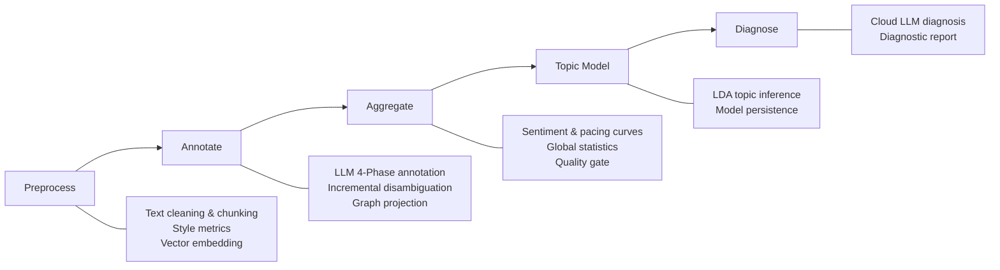
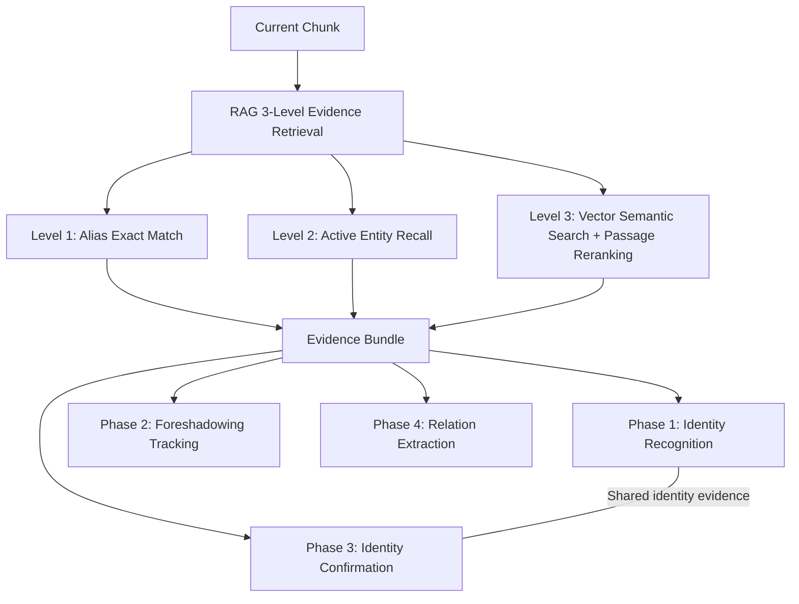

# Novel Quantitative Analysis System


> [中文文档](README.md)

## Introduction

An intelligent analysis platform for Chinese web novels, combining Natural Language Processing, Large Language Models and graph computing to provide end-to-end automated analysis — from text ingestion to diagnostic reports.

The system accepts `.txt` novel files and automatically handles encoding detection, text cleaning, word segmentation and semantic chunking. A five-stage pipeline (Preprocessing → Annotation → Aggregation → Topic Modeling → Diagnosis) produces analysis results, with each stage independently persisted and resumable.

### Core Capabilities

| Capability | Description |
|------------|-------------|
| **LLM-powered Annotation** | Four-phase annotation: Identity Recognition → Foreshadowing Tracking → Identity Confirmation → Relation Extraction. Supports streaming and structured output |
| **Three-level Evidence Retrieval (RAG)** | Level 1: alias exact match → Level 2: active entity recall → Level 3: vector semantic search + passage reranking. Provides context for annotation |
| **Entity Disambiguation** | Incremental disambiguation (every N chunks) + full disambiguation (final). Automatically identifies character aliases and anonymous characters |
| **Multi-dimensional Quantitative Metrics** | Sentiment curve, pacing curve, lexical richness (TTR/MTLD), sentence length stats, dialogue ratio, narrative structure recognition |
| **Knowledge Graph** | Character relationship network construction and visualization, canonical knowledge graph, entity alias management |
| **Topic Modeling** | LDA topic inference, topic-document assignment, topic word clouds |
| **Diagnostic Report** | Cloud LLM generates overall quality assessment covering narrative type, themes and values |
| **Real-time Progress** | SSE pushes analysis progress to the frontend. Supports task creation, cancellation and resumption |

### Tech Stack

| Layer | Technologies |
|-------|-------------|
| Backend | Python 3.12 / FastAPI / SQLAlchemy / PostgreSQL 17 (pgvector) |
| Models | OpenAI SDK (compatible with local vLLM and cloud models) / jieba / gensim / NetworkX |
| Frontend | React 19 / TypeScript / ECharts / AntV G6 / Radix UI / Tailwind CSS |
| Deployment | Docker Compose / Nginx |

## Quick Start

### Docker Deployment (Recommended)

1. Configure environment variables

   ```powershell
   Copy-Item .env.docker.example .env.docker
   # Edit .env.docker to set model API endpoint and keys
   ```

2. Start services

   ```powershell
   docker compose up -d --build
   ```

3. Access services

   - Frontend: <http://localhost:18080>
   - API Docs: <http://localhost:18080/api/docs>

### Source Installation

1. Install dependencies

   ```powershell
   ./scripts/dev.ps1 setup
   ```

2. Configure environment variables

   ```powershell
   Copy-Item .env.example .env
   # Edit .env to set database connection and model API keys
   ```

3. Initialize database and start

   ```powershell
   alembic upgrade head
   ./scripts/dev.ps1 api --port 8000
   ```

4. Start frontend (in a new terminal)

   ```powershell
   cd frontend
   npm install
   npm run dev
   ```

   Frontend available at <http://localhost:5173>, with Vite proxy forwarding `/api` to backend port 8000.

## Configuration

### Config Files

- `config/settings.json` — Application parameters (models, chunking, metrics, etc.)
- `.env` / `.env.docker` — Environment variables and secrets

### Environment Variables

Refer to `.env.example` and `.env.docker.example` for the full list of configuration options.

**Required:**

- `DATABASE_URL` / `DATABASE_USERNAME` / `DATABASE_PASSWORD` — Database connection
- `ANNOTATION_*` — Annotation model service
- `SEMANTIC_CHUNKING_*` — Semantic chunking embedding service
- `FULL_DISAMBIG_*` — Full disambiguation model
- `DIAGNOSIS_*` — Diagnosis model

**Optional:**

- `ANNOTATION_FALLBACK_*` — Annotation fallback model
- `INCREMENTAL_DISAMBIG_*` — Incremental disambiguation model
- `MENTION_EXTRACTION_*` — LLM mention extraction model
- `LEVEL3_RERANK_*` — Level 3 reranking model
- `TEST_DATABASE_URL` — Test database (required for running tests)

## Usage

### API Example

```python
import requests

# Upload a novel
response = requests.post(
    "http://localhost:8000/api/novels/upload",
    files={"file": open("novel.txt", "rb")}
)

# Start analysis
novel_id = response.json()["novel_id"]
analysis_response = requests.post(
    f"http://localhost:8000/api/novels/{novel_id}/tasks"
)
```

### Frontend Usage

Access <http://localhost:18080> (Docker) or <http://localhost:5173> (source):

1. Upload a novel file
2. Select analysis configuration
3. Start the analysis task
4. View results and visualizations

## API Documentation

After starting the service:

- Docker mode: <http://localhost:18080/api/docs>
- Source mode: <http://localhost:8000/api/docs>
- ReDoc (source mode): <http://localhost:8000/api/redoc>

## Architecture

### System Layers

The system follows a four-layer architecture with unidirectional dependencies:

```
┌─────────────────────────────────────────────────────────┐
│  API Layer (src/api/routes, models, dependencies)       │
│  HTTP parameter binding, response assembly, SSE push    │
├─────────────────────────────────────────────────────────┤
│  Service Layer (src/api/services)                       │
│  Task lifecycle orchestration, stage scheduling,        │
│  cancel/delete state machine, result queries            │
├─────────────────────────────────────────────────────────┤
│  Workflow Layer (src/workflows)                         │
│  Core business logic: preprocessing, annotation,        │
│  aggregation, topic modeling, diagnosis                 │
│  HTTP-agnostic, callable from both API and CLI          │
├─────────────────────────────────────────────────────────┤
│  Domain + Storage Layer (src/storage, rag, models, ...) │
│  Data persistence, LLM interaction, metric computation, │
│  evidence retrieval, knowledge graph                    │
└─────────────────────────────────────────────────────────┘
```

Call direction: `Route → Service → StageExecutor → Workflow → Domain/Storage`

### Analysis Workflow

Analysis tasks execute strictly in the following stage order. Each stage persists results upon completion, supporting resumable execution:



| Stage | Entry Point | Output |
|-------|-------------|--------|
| **Preprocessing** | `run_preprocess` | Text cleaning & chunking, style metrics, vector embeddings |
| **Annotation** | `run_annotate` | LLM 4-Phase annotation (identity → foreshadowing → confirmation → relations), incremental disambiguation, graph projection |
| **Aggregation** | `run_aggregate` | Sentiment & pacing curves, global statistics, quality gate checks |
| **Topic Modeling** | `run_topic_model` | LDA topic inference and model persistence |
| **Diagnosis** | `run_diagnose` | Cloud LLM diagnostic report |

### Annotation & RAG Interaction

The annotation stage is the most complex part of the system. Before annotating each chunk, a three-level RAG evidence retrieval is invoked:



Phase 1 and Phase 3 share identity evidence to avoid redundant retrieval.

### Design Principles

- **Database as single source of truth** — TaskManager is only an in-process execution cache; all state queries go through the database
- **Resumable stages** — Each stage persists results upon completion; re-analysis can skip completed stages
- **Dual-layer cancellation signal** — In-memory `cancel_event` (fast response) + DB `cancel_requested` (cross-process reliable)
- **Progressive three-level RAG** — Level 1 exact match → Level 2 active entities → Level 3 semantic search; each level can be independently toggled

## Roadmap

The following are confirmed but not yet implemented items, sorted by priority:

| Direction | Status | Description |
|-----------|--------|-------------|
| Phase 1 runtime alignment & prompt splitting | Pending | Resolve Phase 1 bypassing unified thin runtime and prompt hardcoding issues |
| Topic naming migration to topic stage | To be implemented | Move topic naming responsibility from diagnosis to topic stage; diagnosis no longer owns topic naming |
| Ensemble learning multi-signal voting framework | Design draft | Unified arbitration for vocabulary, rules, LLM annotation and other multi-source signal conflicts, replacing manual weights |
| Annotation router & pre-judgment | Under evaluation | Evaluate on-demand triggering of Phase 2/3/4 scheduling strategy to reduce API call costs |
| LLM context budget & prompt trimming | Discussion draft | Multiple LLM interaction chains have underutilized context; pending token distribution analysis before deciding approach |
| Incremental/full disambiguation & diagnosis SSE | Status review | Incremental and full disambiguation lack independent SSE; diagnosis has no streaming output — to be refactored |
| Level 3 mention retrieval evaluation | Postponed | Mention-level recall and paragraph-level local evidence evaluation loop postponed; not blocking main pipeline |
