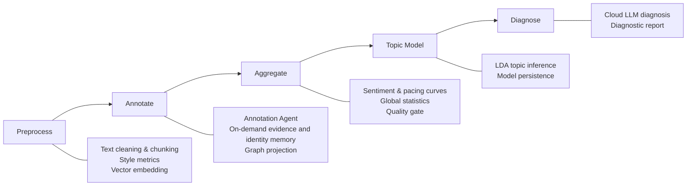
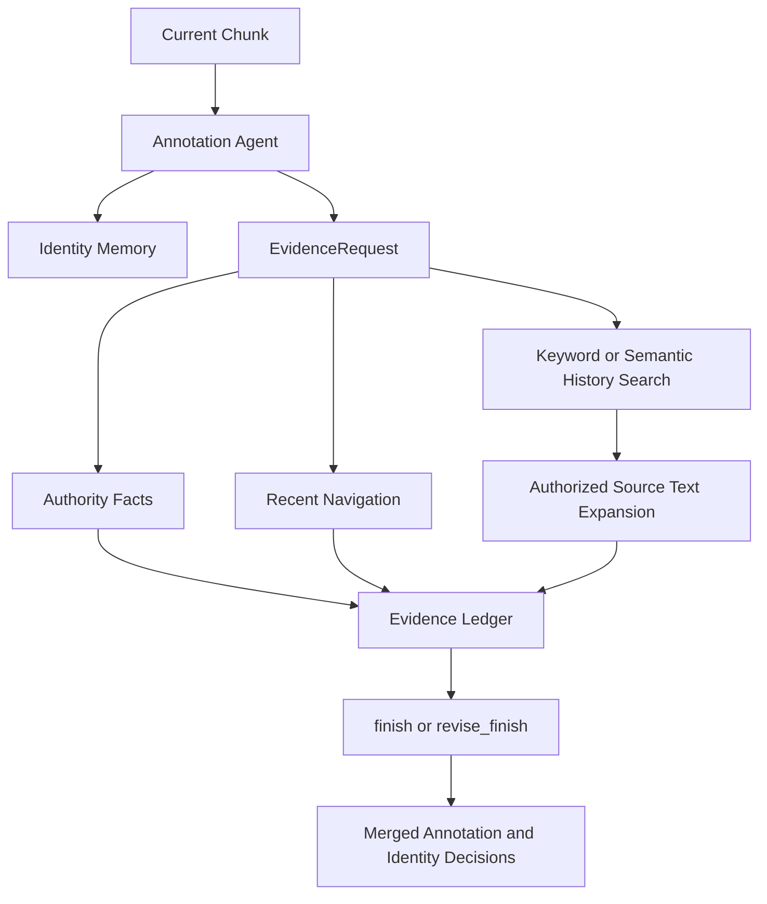

# NovelIQ


> [中文文档](README.md)

## Introduction

An intelligent analysis platform for Chinese web novels, combining Natural Language Processing, Large Language Models and graph computing to provide end-to-end automated analysis — from text ingestion to diagnostic reports.

The system accepts `.txt` novel files and automatically handles encoding detection, text cleaning, word segmentation and chapter-first chunking. A five-stage pipeline (Preprocessing → Annotation → Aggregation → Topic Modeling → Diagnosis) produces analysis results, with each stage independently persisted and resumable.

### Core Capabilities

| Capability | Description |
|------------|-------------|
| **LLM-powered Annotation** | A single LangGraph Agent calls identity, authority-fact, and historical-text tools as needed, then submits characters, foreshadowing, dialogue, relations, and identity decisions together |
| **Unified Evidence Retrieval (RAG)** | `EvidenceRequest` defines the historical boundary and read authorization for authority facts, navigation, keyword search, semantic search, and source-text expansion |
| **Entity Disambiguation** | The annotation Agent maintains identity memory in the same tool loop; low-confidence decisions are not persisted across chunks |
| **Multi-dimensional Quantitative Metrics** | Sentiment curve, pacing curve, lexical richness (TTR/MTLD), sentence length stats, dialogue ratio, narrative structure recognition |
| **Knowledge Graph** | Character relationship network construction and visualization, canonical knowledge graph, entity alias management |
| **Topic Modeling** | LDA topic inference, topic-document assignment, topic word clouds |
| **Diagnostic Report** | Cloud LLM generates overall quality assessment covering narrative type, themes and values |
| **Real-time Progress** | SSE pushes analysis progress to the frontend. Supports task creation, cancellation and resumption |

### Tech Stack

| Layer | Technologies |
|-------|-------------|
| Backend | Python 3.12 / FastAPI / SQLAlchemy / PostgreSQL 17 (pgvector) |
| Models | OpenAI SDK (compatible with local vLLM and cloud models) / jieba / gensim / NetworkX |
| Frontend | React 19 / TypeScript / ECharts / AntV G6 / Radix UI / Tailwind CSS |
| Deployment | Docker Compose / Nginx |

## Quick Start

### Docker Deployment (Recommended)

1. Configure environment variables

   ```powershell
   Copy-Item .env.docker.example .env.docker
   # Edit .env.docker to set model API endpoint and keys
   ```

2. Start services

   ```powershell
   docker compose up -d --build
   ```

3. Access services

   - Frontend: <http://localhost:18080>
   - API Docs: <http://localhost:18080/api/docs>

### Source Installation

1. Install dependencies

   ```powershell
   ./scripts/dev.ps1 setup
   ```

2. Configure environment variables

   ```powershell
   Copy-Item .env.example .env
   # Edit .env to set database connection and model API keys
   ```

3. Initialize database and start

   ```powershell
   alembic upgrade head
   ./scripts/dev.ps1 api --port 8000
   ```

4. Start frontend (in a new terminal)

   ```powershell
   cd frontend
   npm install
   npm run dev
   ```

   Frontend available at <http://localhost:5173>, with Vite proxy forwarding `/api` to backend port 8000.

## Configuration

### Config Files

- `config/settings.json` — Application parameters (models, chunking, metrics, etc.)
- `.env` / `.env.docker` — Database and model service connections

### Environment Variables

The environment files use ordinary flat key-value pairs for the database, test database, text model, and embedding model:

```env
DATABASE_URL=...
DATABASE_USERNAME=...
DATABASE_PASSWORD=...
TEST_DATABASE_URL=...
TEST_DATABASE_USERNAME=...
TEST_DATABASE_PASSWORD=...
MODEL_BASE_URL=...
MODEL_ID=...
MODEL_KEY=...
EMBEDDING_MODEL_BASE_URL=...
EMBEDDING_MODEL_ID=...
EMBEDDING_MODEL_KEY=...
```

Database credentials remain separate from `DATABASE_URL`; model keys, IDs, and service URLs are also configured independently. Annotation, annotation fallback, and diagnosis share the `MODEL_*` variables. See `.env.example` and `.env.docker.example` for the complete format.

## Usage

### API Example

```python
import requests

# Upload a novel
response = requests.post(
    "http://localhost:8000/api/novels/upload",
    files={"file": open("novel.txt", "rb")}
)

# Start analysis
novel_id = response.json()["novel_id"]
analysis_response = requests.post(
    f"http://localhost:8000/api/novels/{novel_id}/tasks"
)
```

### Frontend Usage

Access <http://localhost:18080> (Docker) or <http://localhost:5173> (source):

1. Upload a novel file
2. Select analysis configuration
3. Start the analysis task
4. View results and visualizations

## API Documentation

After starting the service:

- Docker mode: <http://localhost:18080/api/docs>
- Source mode: <http://localhost:8000/api/docs>
- ReDoc (source mode): <http://localhost:8000/api/redoc>

## Architecture

### System Layers

The system follows a four-layer architecture with unidirectional dependencies:

```
┌─────────────────────────────────────────────────────────┐
│  API Layer (src/api/routes, models, dependencies)       │
│  HTTP parameter binding, response assembly, SSE push    │
├─────────────────────────────────────────────────────────┤
│  Service Layer (src/api/services)                       │
│  Task lifecycle orchestration, stage scheduling,        │
│  cancel/delete state machine, result queries            │
├─────────────────────────────────────────────────────────┤
│  Workflow Layer (src/workflows)                         │
│  Core business logic: preprocessing, annotation,        │
│  aggregation, topic modeling, diagnosis                 │
│  HTTP-agnostic, orchestrated by the API layer           │
├─────────────────────────────────────────────────────────┤
│  Domain + Storage Layer (src/storage, agents, chapters, ...) │
│  Data persistence, Agent interaction, metric computation, │
│  evidence retrieval, knowledge graph                    │
└─────────────────────────────────────────────────────────┘
```

Call direction: `Route → Service → StageExecutor → Workflow → Domain/Storage`

### Analysis Workflow

Analysis tasks execute strictly in the following stage order. Each stage persists results upon completion, supporting resumable execution:



| Stage | Entry Point | Output |
|-------|-------------|--------|
| **Preprocessing** | `run_preprocess` | Text cleaning & chunking, style metrics, vector embeddings |
| **Annotation** | `run_annotate` | Annotation Agent output, identity decisions, and graph projection |
| **Aggregation** | `run_aggregate` | Sentiment & pacing curves, global statistics, quality gate checks |
| **Topic Modeling** | `run_topic_model` | LDA topic inference and model persistence |
| **Diagnosis** | `run_diagnose` | Diagnosis Agent report grounded in tool evidence |

### Annotation & RAG Interaction

One annotation Agent processes each chunk. It first queries identity memory, then uses `EvidenceRequest` to request authority facts, recent navigation, keyword search, or semantic search as needed. A historical chunk can be expanded only after the same evidence objective authorizes a located result.



The first `finish` submits the complete result. When validation fails, `revise_finish` submits only the top-level fields that need correction. Model responses, valid Provider token usage, and actual tool evidence are recorded for auditing.

### Design Principles

- **Database as single source of truth** — TaskManager is only an in-process execution cache; all state queries go through the database
- **Resumable stages** — Each stage persists results upon completion; re-analysis can skip completed stages
- **Dual-layer cancellation signal** — In-memory `cancel_event` (fast response) + DB `cancel_requested` (cross-process reliable)
- **Evidence authorization loop** — Historical source text must first be located by keyword or semantic search and then expanded under the same evidence objective
- **Traceable results** — Annotation and diagnosis record model responses, valid Provider token usage, and actual evidence sources
- **Bounded tool loops** — Regular tool calls stop at the configured limit to prevent unbounded iteration

## Current Agent Runtime Constraints

- Annotation Agent output must pass validation against the current chunk source text, identity memory, and the evidence ledger for this run
- Diagnosis Agent must call evidence tools, and its topic-label count must match the topic data before it can submit a result
- When the primary annotation model raises `AnnotationAgentRunError`, enabled fallback retries the same chunk with the same identity memory and evidence service
- Annotation, annotation fallback, and diagnosis share one text-model connection; embeddings use a separate connection
