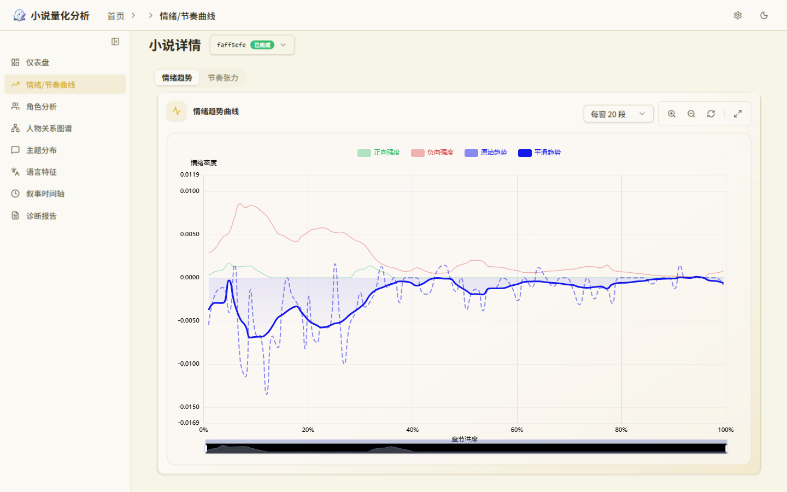
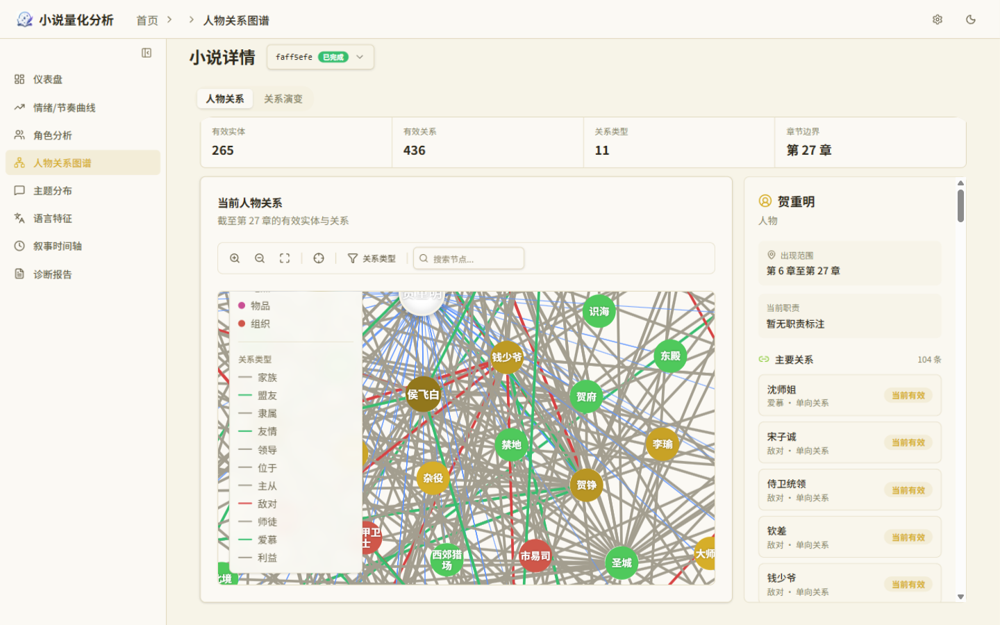
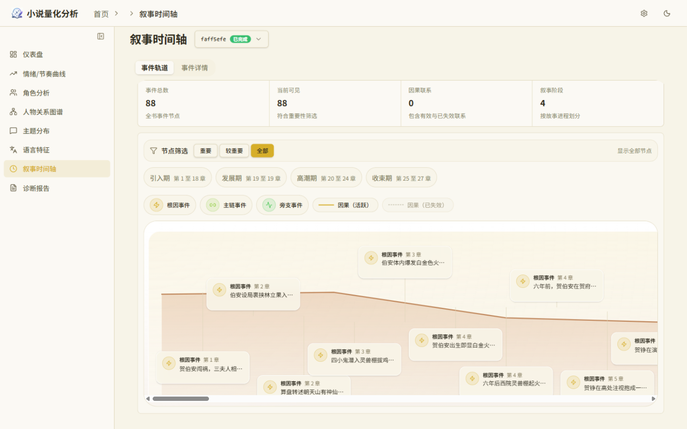
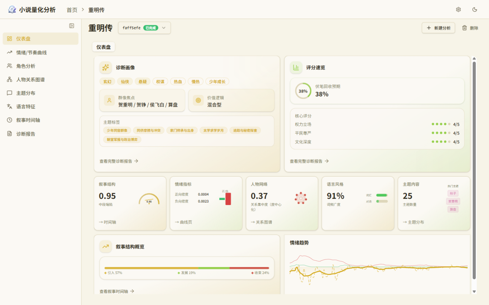
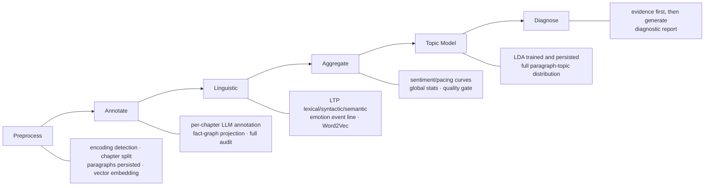

# NovelIQ

> [中文文档](README.md)


[](LICENSE)

A quantitative analysis platform for Chinese web novels: upload a full `.txt` book and a six-stage pipeline analyzes it end to end. An LLM annotates characters, dialogue, relations, events and foreshadowing chapter by chapter, local language models produce multi-dimensional metrics, and everything converges into a set of visual views and a diagnostic report. Analysis runs in the background with each stage persisted as it completes, so interrupted or cancelled runs resume from where they stopped.

Once analysis completes, the frontend provides:

- **Sentiment / pacing curves**: paragraph-level sentiment scoring and narrative pacing metrics, whole-book curves with switchable windows
- **Character relationship graph**: annotation agents record characters, dialogue and relations chapter by chapter, merged across chapters into a network browsed as a force-directed graph
- **Event timeline**: plot events presented along a timeline
- **Topic distribution**: LDA topic modeling that detects topic shifts across the plot
- **Linguistic features**: LTP lexical and syntactic analysis, lexical richness (TTR/MTLD), dialogue ratio, and more
- **Diagnostic report**: an LLM quality assessment grounded in whole-book evidence, exportable as a single-file HTML

| Sentiment / pacing curves | Character relationship graph |
| --- | --- |
|  |  |
| **Narrative timeline** | **Dashboard** |
|  |  |

Stack: Python 3.12 / FastAPI / SQLAlchemy / PostgreSQL 17 (pgvector); React 19 / Vite / ECharts / Tailwind CSS. LLMs go through an OpenAI-compatible interface (local vLLM or a cloud service both work); lexical analysis and word vectors are local offline models.

## Quick Start

### Prerequisites: offline models

LTP and Word2Vec load from local files and **never download over the network**; both can be toggled in settings:

- **LTP** (`linguistic.ltp.enabled`, on by default): a complete offline model directory, path configured via the `LTP_MODEL_DIR` environment variable. If enabled but the model is missing, analysis errors out at the Linguistic Analysis stage; when disabled, lexical/syntactic/semantic annotation is skipped
- **Word2Vec** (`linguistic.word2vec.enabled`, off by default): no model needed while off; once enabled it requires the converted `.kv` main file under `models/word2vec/shared/` (depends on LTP tokens), and a missing file errors at the same stage. For existing `.vec`/`.bin`/`.txt` pretrained vectors, run:

  ```powershell
  uv run python -m scripts.tools.convert_word2vec_pretrained
  ```

  Reads from `models/word2vec/pretrained/` by default and writes to `models/word2vec/shared/`.

The `models/` directory is not tracked by Git; Docker Compose mounts the host directory into the container at `/app/models`.

### Docker deployment (recommended)

```powershell
Copy-Item .env.docker.example .env.docker   # fill in the model API keys
docker compose up -d --build
```

The database settings in `.env.docker` come preset to the Compose-bundled Postgres; the only things to fill in are the text model (`MODEL_*`) and the embedding service address. The model directory is mounted from the host `./models`.

- Frontend: <http://localhost:18080>
- API docs: <http://localhost:18080/api/docs>

### Run from source

Requires a local PostgreSQL 17 with the pgvector extension.

```powershell
./scripts/dev.ps1 setup        # install dependencies (uv)
Copy-Item .env.example .env    # fill in database and model API keys
./scripts/dev.ps1 api --port 8000   # first start creates the database and tables automatically
```

Frontend in another terminal:

```powershell
cd frontend
npm install
npm run dev                    # http://localhost:5173, /api proxied to backend port 8000
```

## System Layers

| Layer | Directory | Key modules |
|----|------|---------|
| **API** | `src/api/routes` | `novels` (upload/tasks), `analysis`, `results`, `tabs` (one aggregation endpoint per frontend view, metrics computed inside the endpoint), `linguistic`, `timeline`, `settings`, `sse` |
| **Service** | `src/api/services` | `analysis_service` (StageExecutor stage scheduling, cancel/delete state machine), `novel_service`, `metrics_service`, `results_export_service` (self-contained HTML report assembly), `event_manager`, `artifact_gc_service` |
| **Workflow** | `src/workflows` | `run_preprocess` / `run_annotate` / `run_linguistic` / `run_aggregate` / `run_topic_model` / `run_diagnose` — business orchestration and persistence only, HTTP-agnostic |
| **Domain** | `src/agents`, `src/metrics`, `src/linguistic`, `src/topic`, `src/lexicons`, `src/text_search`, `src/knowledge` | annotation/diagnosis agents and the fact graph, metric contracts and curves, LTP/Word2Vec, LDA, lexicons, retrieval, knowledge graph |
| **Storage** | `src/storage/models` | ORM definitions for 36 tables, split by domain (graph / event_forest / agent_audit / continuity / analysis / rag …) |

Dependencies point one way: `Route → Service → StageExecutor → Workflow → Domain/Storage`; the reverse never happens. The full path of one request: `POST /api/novels/{id}/tasks` → `analysis_service` creates the `analysis_runs` row → StageExecutor calls each Workflow entry in turn → domain functions read and write the ORM → each stage-completion point pushes a milestone over SSE.

## Analysis Pipeline



| Stage | Entry point | Mechanism and output |
|------|------|-----------|
| **Preprocess** | `run_preprocess` | Encoding detection (utf-8 first, gb18030 / gbk fallback) → chapter splitting on heading lines (Chinese-numeral chapter numbers supported) → chapters and paragraphs persisted → paragraph vector embedding (pgvector). Splitting happens only here; every later stage shares the same paragraph boundaries |
| **Annotate** | `run_annotate` | The heaviest stage of the book. A per-chapter annotation agent (round cap 15) submits the whole chapter in one `finish`: character entities, dialogue, relations, event tree, foreshadowing, metrics and sentence-level emotion labels. Graph-domain changes are persisted through fact-graph derivation (see "Fact Graph"), events land on their anchors (see "Event Tree"); cross-chapter context is carried by the persisted facts and stage summaries of earlier chapters |
| **Linguistic** | `run_linguistic` | LTP segmentation, POS, dependency and semantic-role labeling; emotion event-line extraction (semantic-role driven); fixed-phrase hits; Word2Vec (off by default; once enabled in settings) initialized from pretrained vectors and fine-tuned per book, with the vector dimension taken from the pretrained file header |
| **Aggregate** | `run_aggregate` | Paragraph-level scores aggregated into sentiment/pacing curves and global statistics; sentence-level emotion labels fit a ridge-regression boundary model per book, then scores are written back paragraph by paragraph; quality-gate report — missing aggregate data counts as a defect, "no data" ≠ "passing" |
| **Topic model** | `run_topic_model` | LDA training and model persistence; the full paragraph-topic distribution lands in three tables (`topic_model_runs` / `paragraph_topics` / `paragraph_topic_inference`), and topic shifts are computed as Jensen-Shannon divergence on the response side |
| **Diagnose** | `run_diagnose` | The diagnosis agent (round cap 30) gathers evidence before submitting; when validation rejects, `revise_finish` submits only the fields that need correction, and unsubmitted fields carry over from the last complete result |

**Resume and cancellation** — Every stage persists on completion: reruns after an interruption or cancellation automatically skip finished stages, and you can explicitly rerun only selected stages; cancellation takes effect immediately and works reliably across processes.

**Intra-chapter parallelism and the program face** — Annotation dispatches by chapter size: short chapters go to a single agent that annotates the whole chapter directly; long chapters (over `sub_chunk_max_chars`, default 5000 characters) split into three role-based subagents — structure / event / evidence — each holding the full chapter and running concurrently. The model-visible surface collapses into a single `execute_code(code)`: programs run statement by statement in a restricted AST interpreter, where retrieval, graph writes and event writes are all function calls inside the interpreter — one round submits a batch of operations instead of one tool call per round. Evidence reads only source text before the current chapter by default, preventing future-text leakage; the three lanes share one fact-graph and event-tree contract, and cross-lane disagreements go to the case pool for a unified ruling.

## Quantitative Methods

- **Curves and smoothing** — Sentiment/pacing curves are plotted on character coordinates; smoothing uses robust LOWESS: tricube-kernel weighted local linear regression, three bisquare robust iterations to suppress outlier segments, and bandwidth doubling adaptively when a window lacks enough points. Smoothing anchors to the character positions of paragraph scores (paragraph length as sample weight).
- **Per-book emotion calibration** — Paragraph emotion intensity is scored directly by the sentiment lexicon (negation handled as a shared computation layer, effective within sentence boundaries); the annotation agent picks emotion-bearing paragraphs per chapter as supervision, paragraph vectors across the book fit a linear boundary, and scores are written back per paragraph. With insufficient supervision (fewer than 2 labels, or all identical scores) the field stays empty rather than fabricated; and because each book fits its own scale, curves are not comparable across books.
- **Topics and shifts** — gensim LDA persists a full-parameter snapshot, and the full paragraph-topic distribution (not argmax) lands in three tables; topic shift is the Jensen-Shannon divergence between adjacent window distributions.
- **Narrative phases and tension** — Global/local peak detection divides the book into setup / development / climax / resolution; tension proxies (fuzzy-match density of combat words, exclamation/question density, dialogue ratio, average sentence length) are computed per phase.

## Fact Graph

Cross-chapter characters, facts and relations live on one continuously evolving graph, written chapter by chapter by the annotation agents.

**Single write surface** — The run-level fact graph (FactGraph) is loaded from the database once when the first chapter agent starts; afterwards all chapter agents share that one in-memory graph. Graph-domain write tools update it immediately, and every graph query at runtime (`search_graph`, entity and relation validation) reads only the in-memory graph — the database takes part in persistence only. When a chapter completes, the persistence layer derives a new graph version from the op log and persists it; on interruption recovery the graph is reloaded.

**Entity registration** — `write_entities` has append-and-update semantics: same-name entities merge into one entry, but an already-registered major category (character / location / organization …) cannot change — conflicts error out with a hint to use a distinguishing name. Tags keep order and dedupe; attributes merge by dict, with an explicit null deleting the old key.

**Two-channel relations** — `write_relations` only asserts: new edges enter the graph with support +1, and existing edges return `skipped_existing` without double counting. Strengthening, weakening and severing always go through `resolve_fact_case`, with seven change kinds (assert / reinforce / refine / supersede / weaken / break / retract). `break` / `retract` require the target edge to be currently active, otherwise they error immediately — if severing a non-existent edge were silently accepted, the agent would spiral in "undo → recheck → nothing changed" loops.

**Case closed loop** — Suspected issues are registered into the case pool (`case_pool_cases`): case_type, retrieval keys, description, plus two load-bearing fields — `target_key`, a stable target identifier, and `target_ref`, a read-authorization reference. When a later chapter resolves it via `resolve_fact_case`, the completing transaction first locks the case row, re-checks that the stable target is unchanged (guarding against concurrent drift), verifies through `target_ref` that what was read really is an authorized chapter, and only then writes `case_resolution_mappings`.

**Op logs and replay** — Graph-domain changes accumulate three ordered logs per sub-chunk: `entity_ops` (append semantics), `relation_assert_ops` (fully refilled on every `write_relations`), `relation_change_ops` (carrying reason / case_id / change_kind / ordinal). Final state and logs are two channels: final state makes `search_graph` immediately visible; logs let persistence replay in submission order, with each fact in `graph_facts` and its before / after derived by the persistence layer against current database values. Replay order is fixed: all asserts first, then changes.

**Normalization and defenses** — Entity names normalize to NFC + casefold as the matching key; relations build stable keys from bidirectionally normalized endpoints (unordered relations sort both ends into the key), history loading and runtime share the same key function, so repeated cross-chapter assertions never duplicate edges. Relations whose two endpoints normalize to the same name error out immediately — persistence would otherwise insert a self-loop row violating the distinct-endpoint constraint and blow up the completing transaction. Case-change endpoint keys are built from the names as passed, without secondary resolution — otherwise both endpoints collapse into the representative node within the same character component, the edge key to sever becomes self-referential, and the edge can never be deleted.

## Event Tree

Events are declared in-chapter by the annotation agent (`create_event`); one tree corresponds to one chapter's causal narrative.

**Identity and anchors** — tree_id and event_id are server-generated UUIDs, never reordered and collision-free across sub-chunks. Every event lands source-text anchors: `anchor_paragraph_ids` (a set of paragraphs) + `char_start` / `char_end` (CHECK constraints keep the range valid) + `evidence`; the frontend timeline and later evidence retrieval both point back to the source text through this group of anchors.

**Tree-building protocol** — `create_event` atomically creates a single tree. Causal predecessors reference `cause_tree_id`: for trees already built this chapter, use the tree_id just returned by `create_event`; for earlier-plot trees, first retrieve an authorized tree via `search_event`; referencing a non-existent tree errors immediately, with a pointer in the message. The event domain closes explicitly: the final call passes `description=None` to close the event domain, closing the character dynamic-state (character_observations) domain at the same moment; after closing, no more events may be created.

**Causal layering** — `cause_role` marks the event's role in the tree (root / main / secondary, CHECK constraint); `causal_event_refs` express cross-event causal references as global event_ids, materialized into `event_edges` at persistence.

**Edge lifecycle** — `event_edges` has exactly one type, `causal` (CHECK constraint), with `UNIQUE(run_id, source, target)` preventing duplicate edges; edges manage lifecycle via `is_active` + `expired_at` — when a causal conclusion is overturned by later plot, the edge expires rather than being deleted, keeping historical judgments auditable. Endpoints and chapters are both composite foreign keys (run_id + chapter_id), so references cannot drift out of this run.

**Idempotency** — Nodes and edges both persist under `UNIQUE(run_id, chapter_id, payload_path)`: one payload path within one chapter maps to exactly one row, so repeated submissions never double-persist.

## Audit

Four progressive layers, all fully persisted:

| Table | Granularity | Recorded content |
|----|------|---------|
| `agent_invocations` | one annotation / diagnosis attempt | run_id, task_type (annotation / diagnosis), chapter_id, attempt_number, model_name, model_provider (local / cloud), status (success / error), final_error, start/end times |
| `agent_turns` | one model request round | complete request messages, raw response, context summary, status and errors; six per-round timing columns — TTFT, first visible token, reasoning, model, tool wall-clock, round total |
| `agent_tool_calls` | one tool call | parsed and raw parameter strings, full result, model-facing receipt, independent status and duration |
| `token_usage` | each API usage entry | bucketed by novel / chapter / task_type / call_type / model; five token classes prompt / completion / total / cache_read / reasoning plus cost; agent rounds map one-to-one to `agent_turns.id`, non-agent rows such as embeddings bucket separately; `accounting_source` distinguishes reported from estimated |

Review and attribution treat the audit tables as the single authoritative source — application logs contain no agent-side statistics. Thinking time lives in the `agent_turns` timing columns, cost in `token_usage`, failed rounds pinpoint to `agent_tool_calls` status and error; any chapter's annotation can be replayed round by round from its invocation into a complete decision trace.

## License

[Apache-2.0](LICENSE).
