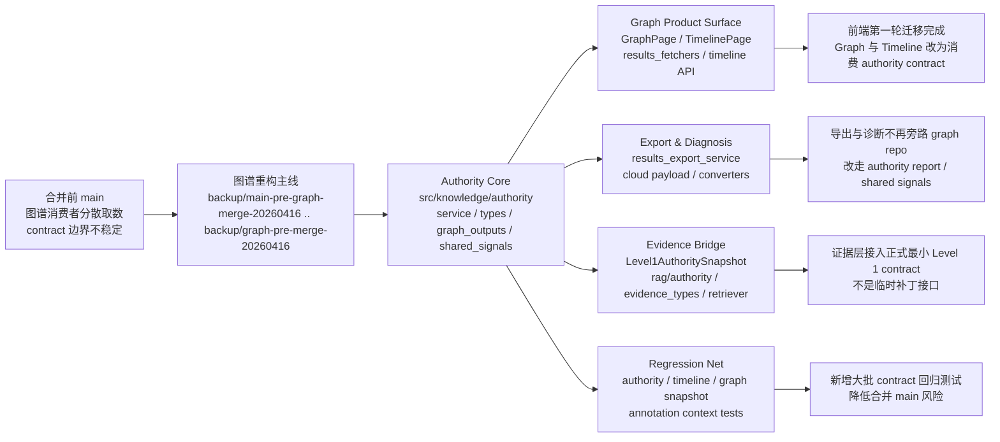
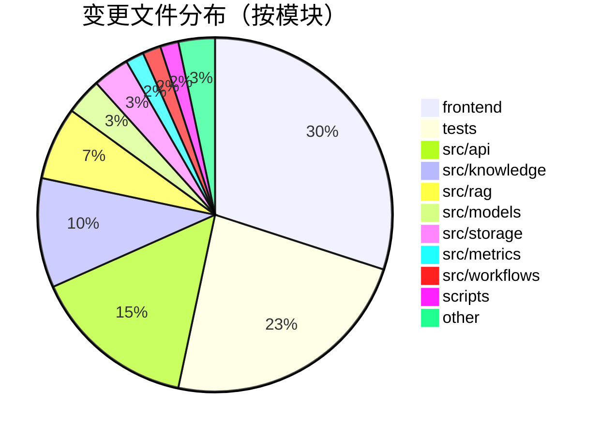

# 图谱重构对比总结报告

## 对比范围

- 对比基线：`backup/main-pre-graph-merge-20260416`
- 对比目标：`backup/graph-pre-merge-20260416`
- 实际落地主干：`main` 上的 merge commit `5353566`

本报告回答的问题是：**重构后的图谱层，相比合并前的 `main`，到底发生了哪些结构性变化。**

## 一页结论

这次差异不是一次局部修补，而是一条完整的图谱主线重构。

- 图谱核心从“消费者各自拼装图谱数据”收口为 `src/knowledge/authority` 下的统一 authority 核心。
- 图谱消费者从“旁路读取”切到“按 contract 消费”，覆盖 Graph、Timeline、Export、Diagnosis 和证据层桥接。
- 产品层变化很大，但真正的结构中心在后端 authority 核心；前端和测试体量大，是因为第一轮 product surface 迁移和回归补强一起落地。
- 图谱到证据层的 `Level1AuthoritySnapshot` 在这次对比范围内已经成为正式 contract，不应再被理解为未完成的临时实现。

## 结构图

## 变更体量分布

整体 diff 统计：

- 60 个文件发生变化
- `+12435 / -661`

按文件数看，变化主要集中在前端、测试和 authority 消费边界。

## 模块统计矩阵

| 模块 | 变更文件数 | 新增行 | 删除行 | 变化含义 |
|---|---:|---:|---:|---|
| `frontend` | 18 | 5972 | 323 | Graph/Timeline 页面、mock、测试基建、页面联动第一轮迁移 |
| `tests` | 14 | 3724 | 83 | 大量 contract 回归与 authority 服务测试补齐 |
| `src/api` | 9 | 680 | 103 | `/results`、`/timeline`、converter、fetcher 改按 authority contract 对外输出 |
| `src/knowledge` | 6 | 1107 | 1 | 新增 authority 核心实现，是这次重构的真正中心 |
| `src/rag` | 4 | 403 | 1 | 接入 `Level1AuthoritySnapshot` 和 evidence bridge |
| `src/models` | 2 | 303 | 1 | payload 与 annotation evidence renderer 收口 |
| `src/storage` | 2 | 20 | 98 | 诊断侧直接 graph repo 读取被收缩或移除 |
| `src/metrics` | 1 | 118 | 19 | timeline authority contract 收紧 |
| `src/workflows` | 1 | 86 | 21 | annotation context 改消费新的 authority / evidence 输出 |
| `scripts` | 1 | 18 | 10 | `scripts/dev.ps1` 入口修复，保障 merge 前验证链路 |

## 关键变化解读

### 1. Authority 核心从无到有建立起来

这部分是最重要的变化，不是边角修补。

- 新增 `src/knowledge/authority/service.py`
- 新增 `src/knowledge/authority/types.py`
- 新增 `src/knowledge/authority/graph_outputs.py`
- 新增 `src/knowledge/authority/shared_signals.py`

这说明图谱层不再只是 repository 的薄包装，而是形成了明确的 authority 层：

- 统一聚合当前图谱状态
- 向不同消费者输出不同视图
- 把 graph page、timeline、export、diagnosis、evidence 的边界写进代码，而不是靠约定维持

### 2. 消费者被强制拉回 authority contract

这一轮最明显的结构变化，是消费者不再各自“顺手取数据”，而是按 authority 约束统一消费。

代表性文件：

- `src/api/routes/results_fetchers/fetchers.py`
- `src/api/routes/timeline.py`
- `src/api/services/results_export_service.py`
- `src/api/routes/results_converters.py`
- `src/models/cloud/payload.py`

这类变化的意义是：

- Graph Page 不再旁路拼 summary / quality / relation history
- Timeline 改按 lifecycle / authority contract 输出
- Export 与 Diagnosis 的图谱衍生字段不再各自发明语义

### 3. 产品层不是“顺便动了前端”，而是第一轮 surface 迁移

前端变化体量最大，但这不是因为页面杂乱，而是因为第一轮产品层迁移和回归保护一起完成了。

代表性文件：

- `frontend/src/pages/GraphPage.tsx`
- `frontend/src/pages/TimelinePage.tsx`
- `frontend/src/components/timeline/TimelineNodeDetail.tsx`
- `frontend/src/pages/GraphPage.test.tsx`
- `frontend/src/pages/TimelinePage.test.tsx`

这部分可以概括为三件事：

- Graph / Timeline 页面切换到新的 authority 输出面
- deep-link、task 切换、侧栏状态等行为被补做了边界修复
- 页面级测试从弱覆盖升级成明确的 contract 回归

### 4. 证据层桥接被正式写实

代表性文件：

- `src/rag/authority.py`
- `src/rag/evidence_types.py`
- `src/rag/retriever.py`
- `src/models/local/annotation/evidence_renderer.py`
- `src/workflows/annotate_helpers/context.py`

这一组变化说明：

- `Level1AuthoritySnapshot` 已经成为图谱到 evidence layer 的正式 handoff
- annotation/disambiguation 的 evidence 组装不再只靠零散上下文字符串
- evidence layer 消费的是**范围刻意最小，但实现完整**的 `Level 1` contract

所以如果只看“图谱是否已经把完整领域层全部塞给 evidence”，答案是否定的；但如果看“图谱到 evidence 的正式最小 contract 是否完成”，答案是肯定的。

### 5. 测试新增量非常大，而且是结构性测试

新增和大改的测试不是装饰，而是这次重构能并入 `main` 的关键原因。

代表性文件：

- `tests/knowledge/test_authority_service.py`
- `tests/api/test_graph_snapshot_contract.py`
- `tests/api/test_results_export_timeline_contract.py`
- `tests/metrics/test_timeline_authority_contract.py`
- `tests/rag/test_authority_snapshot.py`
- `tests/workflows/annotate_helpers/test_context.py`

这批测试覆盖的不是“某个函数返回值”，而是：

- authority service 的输出边界
- graph / timeline / export 的 contract
- evidence / annotation context 的桥接行为

这意味着本轮重构的稳定性主要来自“contract 被代码化并测试化”，而不是人工口头保证。

## 最值得看的高影响文件

如果只想抓住这轮重构的骨架，优先看下面这些文件：

| 文件 | 为什么重要 |
|---|---|
| `src/knowledge/authority/service.py` | authority 核心入口，决定谁能拿到什么视图 |
| `src/knowledge/authority/types.py` | contract 定义中心，决定输出边界 |
| `src/knowledge/authority/graph_outputs.py` | graph page / report 语义从这里落地 |
| `src/api/routes/results_fetchers/fetchers.py` | 产品层如何真正消费 authority |
| `src/metrics/timeline_metrics.py` | timeline contract 如何与 authority 对齐 |
| `src/rag/retriever.py` | evidence bridge 与 Level 1 handoff 的关键接缝 |
| `frontend/src/pages/GraphPage.tsx` | product surface 第一轮迁移的主要承载点 |
| `tests/knowledge/test_authority_service.py` | authority 重构是否成立的最核心测试 |

## 这份 diff 里哪些内容“体量大但不代表核心更复杂”

有两块变化会把体量放大，但不应误判为图谱领域模型本身更复杂：

- `frontend/package-lock.json`
  这会显著抬高新增行数，但不是图谱语义扩张。
- 页面测试与 mock 数据
  这说明重构在补回归保护，不代表后端图谱模型又多了一层领域抽象。

## 最终判断

把这次对比浓缩成一句话：

**图谱层相对旧 `main` 的变化，本质上是“从分散消费的图谱数据访问”升级成“以 authority 为中心的统一 contract 层”，并把 Graph、Timeline、Export、Diagnosis、Evidence 的消费边界第一次完整拉齐。**

如果再进一步压缩成三个关键词，就是：

- authority 核心成型
- 消费边界收口
- 产品与测试同步跟上

## 附：提交脉络摘要

对比区间内，最能代表主线脉络的提交包括：

- `aad52d5` `refactor(knowledge-graph): add authority service and consumer views`
- `664c78b` `fix(authority): tighten level1 contract and align graph evidence views`
- `84bd1d7` `feat(timeline): 补齐 timeline 与 graph 的事件联动并收紧 graph authority 消费边界`
- `560f67d` `feat(graph): 启动 graph product surface 第一轮迁移`
- `83d7d13` `refactor(export): 收口 graph-derived 导出 payload 到 authority 视图`
- `c6790fd` `refactor(graph): 冻结 diagnosis 与 aggregate 的 authority 职责边界`
- `de17fbf` `merge(graph): 合并 stage5 收尾分支并收口 Stage 5 边界修复`
- `96b41d0` `fix(graph): 修复图谱主线合并前的脚本入口与类型阻塞项`

这条提交链说明，本轮不是“一次性大爆改”，而是沿着 authority contract、consumer 边界、product surface、回归验证四条线逐步收口，最后才进入主干。
